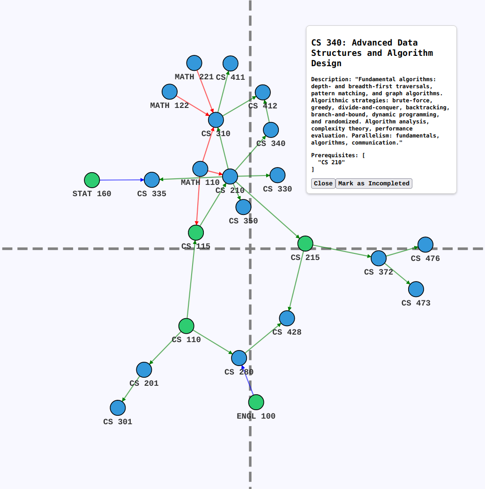

# CourseVisualizer

Display your college courses as an easy-to-understand **interactive graph**!



This project displays course `codes`, `names`, `descriptions`, and `prerequisites` as a **force-directed graph** using [D3.js](https://d3js.org/)

Feel free to fork this and make your own changes! I'd love to see your take on this project.

## Features
- Draggable Nodes
- Toggle Completed Courses
- Custom JSON Input (Input your own courses in JSON format)


## Setup

1. Clone or download this repository in a directory of your choice

```git clone https://github.com/mohammadzfr/CourseVisualizer```

2. If you have a JSON file that only has nodes and no links between them, you can create links for it by using the `process_data.js` file, which will use the `prerequisites` field to create links
    - I recommend downloading and using **[bun](https://bun.sh/)** or [NodeJS](https://nodejs.org/en) to run the js file
    - After downloading, use `bun process_data.js` or `node process_data.js` in the `CourseVisualizer` directory

3. Enter the PATH of your compatible JSON file into the `jsonUrl` variable in `graph.js`

4. Run the HTML file in localhost
    - You can use the `Live Server` extension in VSCode or anything similar

5. Currently `input.json` is used in `process_data.js` and `example.json`, `example2.json`, and `example3.json` are used in `graph.js`

6. Enjoy!

## Future Features
- Adding a save/load feature for modified JSON files
- A page that allows you to add your own courses through the UI without messing with JSON
- Upload a transcript to automatically create a JSON with all completed classes
- Adding a field to see which semester you took a course if at all
## Project Overview
```
CourseVisualizer/
|── assets/
|   |── signature.ico // favicon
|   |── CourseVisThumbnail.png // thumbnail for README
|
|── index.html // boilerplate
|── style.css
|── graph.js // the main program
|── process_data.js // for creating links out of nodes
|── example.json // ideal setup of nodes and links for graph.js
|── input.json // ideal setup of nodes for process_data.js
|── raw-catalogue.txt // Document where all the courses are scraped from

```
